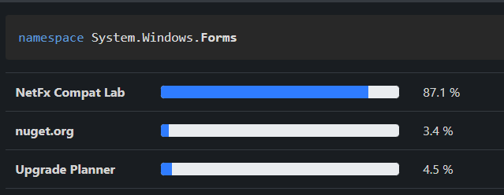

# .NET Upgrade Planner Privacy Statement

The .NET Upgrade Planner sends anonymous API usage information to [apisof.net].
The data doesn't contain personal identifiable information (PII).

The aggregated data is publicly accessible on the website as a percentage:

*The percentage that is being reported on [apisof.net] is the number of
assemblies using a given API divided by the total number of assemblies analyzed
by .NET Upgrade Planner.*

## What is being collected

The data that is being sent back is of the following format:

1. One document per user assembly that is being analyzed
2. The document has a unique id, which is a SH256 hash over the assembly name.
3. The document contains the list of used API ids. The API id is a GUID that is
   derived from the MD5 hash of the API's [documentation ID][doc-id].

The catalog knows about specific APIs (mostly platform APIs but in some cases
also widely used community maintained NuGet packages) and uses their API id
to compute the percentage of documents that they occur in.

The intent is to understand what the most used APIs are that people depend on
when planning their porting efforts.

Please note [apisof.net] won't see any of your assembly or API names -- merely
their hashes.

[apisof.net]: https://apisof.net
[doc-id]: https://learn.microsoft.com/en-us/dotnet/csharp/language-reference/language-specification/documentation-comments#d4-processing-the-documentation-file
